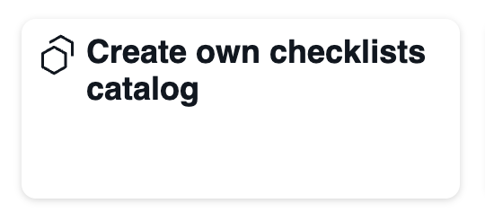

# Checklists catalog

A web interface for working with open-checklists.

## Running locally

1. `npm i`
2. `npm run dev`

## How it works

Checklists catalog uses [Nuxt Content](https://content.nuxt.com/) for 
working with checklists.

Just create a `.json` file in the `content` directory.

To create an open-checklists json file you can use [the constructor](https://github.com/cyevgeniy/open-checklist-constructor).

## Customization

To customize appearance of the catalog, the `catalog.ts` file is used.
Configuration example:

```ts
export const config = defineConfig({
    githubUrl: 'https://github.com/cyevgeniy',
    title: 'Open Checklists',
    nav: [
        {text: 'What is it?', link: 'https://github.com', target: "_blank"},
        {text: 'Want my own!', link: '/list-own'}
    ],
    footer: {
        text: 'Open Checklists, 2025'
    }
})
```

`defineConfig` function accepts `Config` object:


```ts
interface Config {
    /**
     * Link to a github repo
     */
    githubUrl?: string

    /**
     * The title of the site.
     * Will be shown in the header
     */
    title: string

    nav?: NavLink[]

    footer?: Footer
}
```

### `NavLink`

```ts
interface NavLink {
    /**
     * Link text
     * @example 'My projects'
     */
    text: string

    /**
     * URL of the link
     * @example 'https://example.com'
     * @example '/list-own'
     */
    link: string

    /**
     * target attribute
     * @example '_blank'
     */
    target?: string
}
```

### `Footer`

```ts
interface Footer {
    /**
     * Text to display in the footer
     * @example 'Made with Nuxt by John Doe'
     */
    text?: string
}
```

### Icons

You can add an icon to the checklist card by extending your checklists with
`_icon` field. It should contain an icon name from Iconify: 

```json
{
  "title": "Create own checklists catalog",
  "description": "",
  "created_at": "2025-08-15",
  "_icon": "carbon:carbon",
  "items": [
    ...
  ]
}
```



### tags

You can add a tags list to each checklist with the `_tags` field:

```json
{
  "title": "Signup and login forms",
  "_tags": ["form", "example"],
  "items": [
    ...
  ]
}
```

## Misc

Icon for the logo: `icon-park-outline:check-one`.

Color: #12a627;